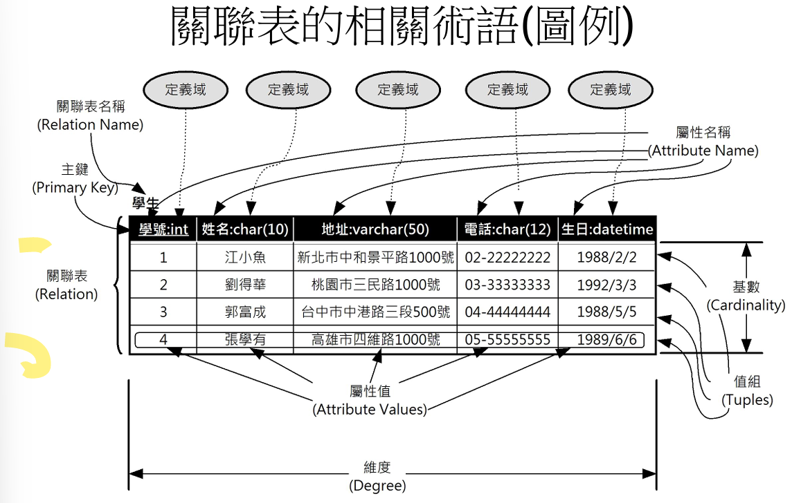
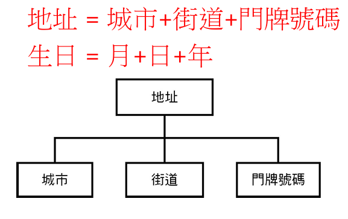

## 關聯表綱要

### 關聯表
- 二維表格，每個關聯表有一個唯一的關聯表名稱
- 屬性，關聯表的屬性是一個集合，不能重複
- 值組
- 維度
- 基數，值組數目
- 主鍵，用來識別值是唯一的
- 定義域，屬性值要符合定

#### 定義域
- 一組可被接受的值組
- 簡單屬性，不可再分割
- 複合屬性，簡單屬性組成，可建立一個階層架構  

#### 屬性值
- 單元值，不可分割
- 需指派一個定義域，且只能有一個定義域
- 可能為空值

#### 空值
- Null Values，特殊符號，不是0，不是空字串
- 未知值
  - 找不到，值在但找不到
  - 完全未知，不知道值是否存在
- 不適性，沒有匹配值

#### 關聯表特性
- 名稱唯一，不能有同名的關聯表，同一個關聯表不能有同名的屬性，但不同關聯表之間可以有相同的屬性名
- 沒有重複值組

## 關聯式代數
- 低階運算子導向語言，描述查詢解果的步驟
- 運算子
  - 交集：∩
  - 聯集：∪ 
  - 差及：－ 
  - 卡笛聲乘積：ｘ
- 特殊關聯式運算子
  - 選取：δ 
  - 投影：π
  - 合併
  - 除法：÷ 
  

## 關聯式計算
- 高階宣告式語言，非程序式查詢語言
- 使用組值或定義域變數建立查詢運算式
SQL結構化查詢語言的基礎就是關連式代數和計算  
SQL語言的語法可視為關連式計算的版本

#### 鍵
- 主鍵
- 超鍵
  - 絕不是空值
  - 永遠不變
  - 本身沒有其他意義
  - 間單的值
- 候補鍵
- 替代鍵
- 外來鍵，參考其他關聯表或同一個關聯表的主鍵，在關連式資料庫中扮演連結關聯鍵的膠水功能
- 