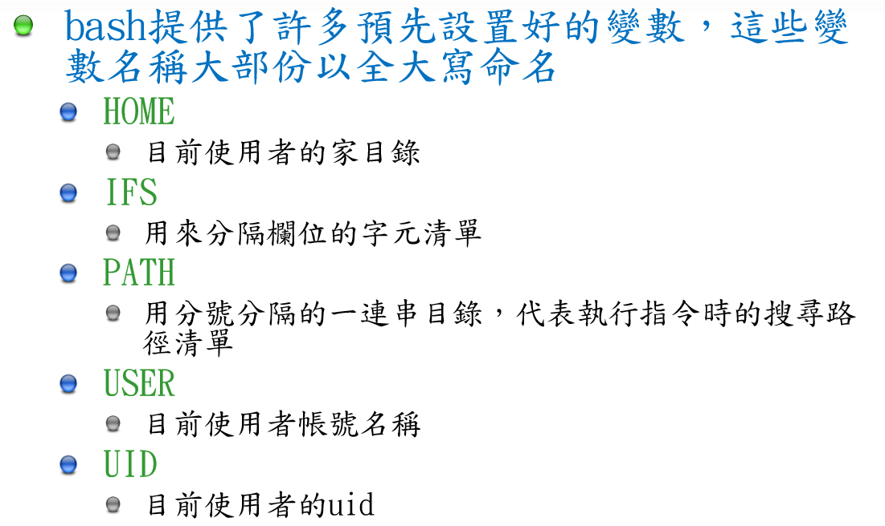
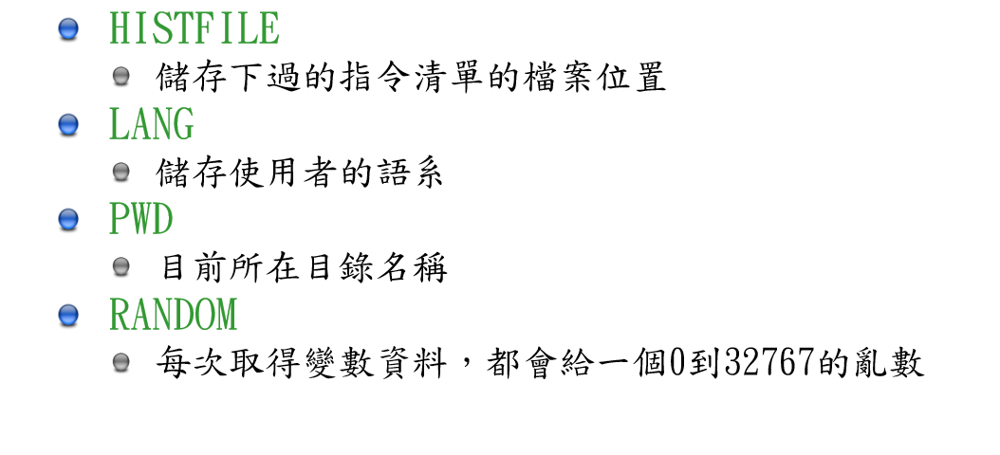
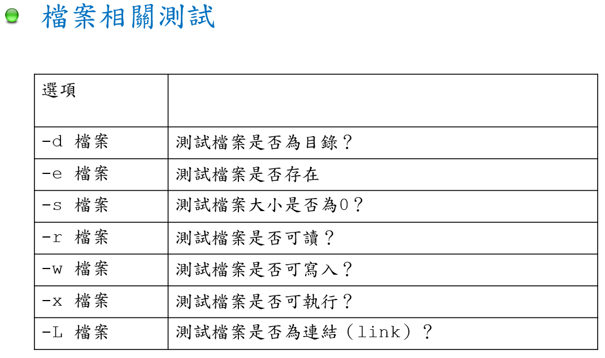
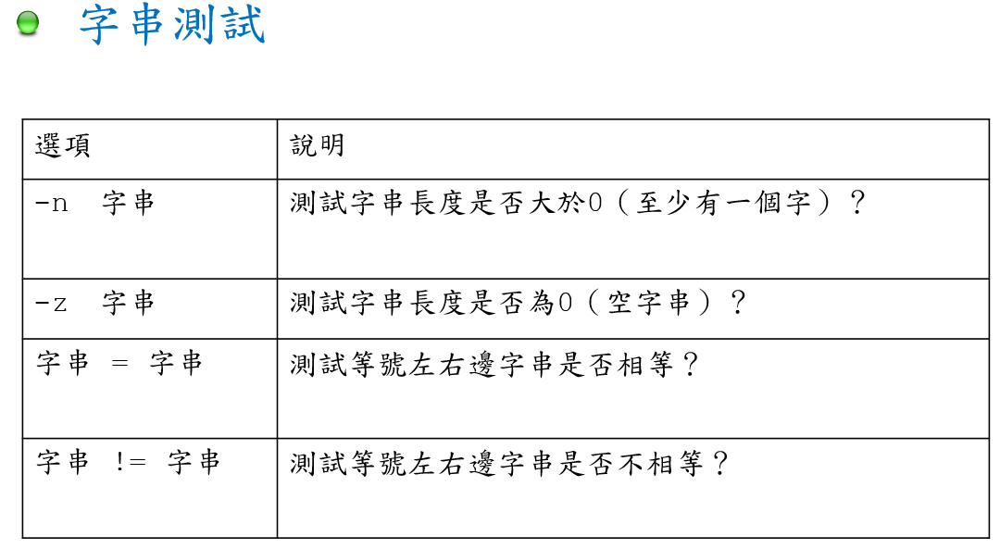
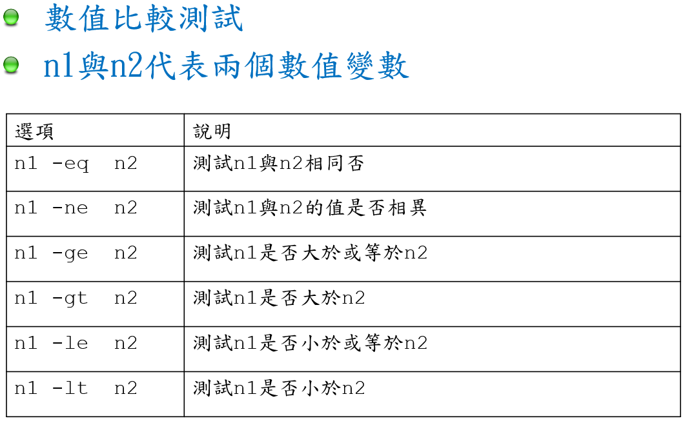
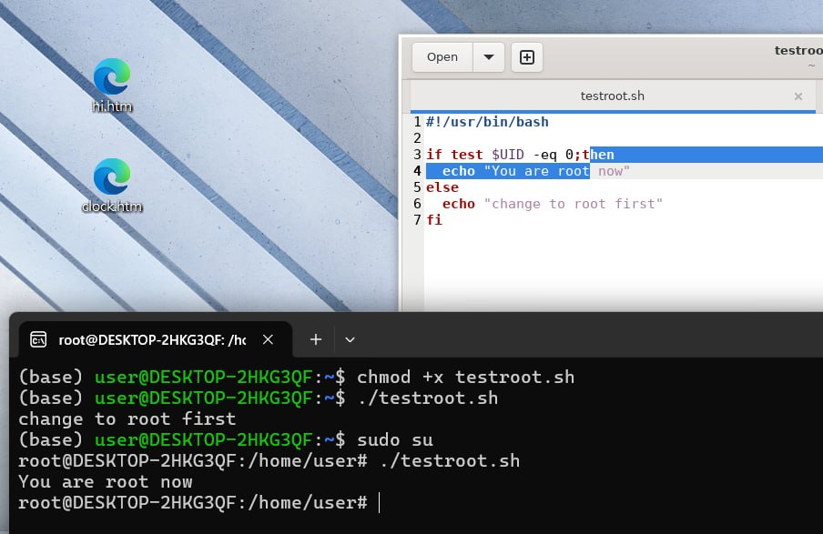

# 4028善用Shell設計


## 指令

### 1. alias
1. alias  
```alias[別名]=[指令名稱]```  
參數說明：若不加任何參數，則列出目前所有的別名设置。

2. 創建別名  
```
alias ll='ls -alF'
/ 此命令創建一个名為 ll 的別名，用于顯示當前前目錄下所有文件和目錄的詳細列表
```

3. 顯示別名&刪除別名  
```
alias       //顯示所有別名
unalias     //刪除所有別名
unalias ll  //刪除名為ll的別名
```

4. 啟用顏色輸出  
```alias ls='ls --color=auto'```

5. 讓電腦記住別名
```
# 第一步：用 nano 編輯器打開你的設定檔（記事本）
nano ~/.bashrc

# 第二步：用鍵盤的 ↓ 箭頭一直滑到檔案最下面，然後把你取的小名寫進去
# 例如把這行寫在最下面：
# alias ll='ls -alF'
# 寫完後，按 Ctrl + O 存檔，按 Enter 確認，再按 Ctrl + X 離開。

# 第三步：叫電腦「立刻重新讀取」剛剛改好的筆記！(這步很重要！)
source ~/.bashrc
```

### 2. echo
1. 基本語法  
```
# 讓電腦在畫面上印出 Hello World
echo "Hello World"
```

2. 搭配其他符號  
```
# 印出你現在登入的使用者名稱
echo "我是誰：$USER"

# 印出你現在身處的資料夾路徑 (等於 pwd)
echo "我在哪裡：$PWD"

# 印出電腦找指令的路徑 (環境變數)
echo "$PATH"
```




3. 寫入筆記本(覆蓋檔案：>)  
把 echo 講的話，直接存成一個檔案  
**注意： 一個大於符號 > 會把檔案裡原本的東西全部殺掉，換成你新寫的！**  
```
# 創造一個叫做 test.txt 的檔案，裡面寫著 "這是一行字"
# 如果 test.txt 原本就有東西，會被清空覆蓋！
echo "這是一行字" > test.txt
```

4.  補充在筆記本最後面(附加檔案：>>)  
**如果不想要原本的內容不見，想要接在後面寫，就要用兩個大於符號 >>**  
```
# 在 test.txt 的最後面，加上 "這是第二行字"
# 原本的第一行字還會活著！
echo "這是第二行字" >> test.txt
```

5. 搭配別名(alisa)使用  
可以用 echo 直接把設定寫進 .bashrc 裡
```
# 直接把「小名設定」寫進 .bashrc 的最下面（記得用單引號包住指令部分）
echo "alias ll='ls -alF'" >> ~/.bashrc

# 寫完記得叫電腦重新讀取！
source ~/.bashrc
```  

5. 測試test  

#### ```$?```
使否執行成功  
- 0 = 成功
- 1 = 失敗

  
- 檔案存在  
```
# 1. 查 secret.txt 存不存在 (-e)
# 按下 Enter 後，畫面會毫無反應，這是正常的！
test -e secret.txt

# 2. 回傳任務結果
echo $?

# 電腦會吐出：
# 0
# (代表零失誤，檔案存在)
```

- 檔案不存在  
```
# 1. 查 ghost.txt 存不存在
test -e ghost.txt

# 2. 回傳任務結果
echo $?

# 電腦會吐出：
# 1
# (代表任務失敗，找不到這個檔案)
```

- 進階測試  
```
# 1. 查它是不是一個「普通的檔案」(file)
test -f secret.txt
echo $?

# 2. 查它是不是一個「資料夾/目錄」(directory)
test -d my_folder
echo $?
```

- 字串測試
  
在測試字串時,變數要加上""

- 比較運算式



## 腳本
  
當以一般使用者身分執行時，條件不成立，輸出 change to root first。    
透過 sudo su 指令切換至 root 身分後執行，條件成立，成功輸出 You are root now[cite: 1]。

### 迴圈控制
```
#!/usr/bin/bash

for filename in $(ls /tmp)
do
    echo $filename
done
```
* **執行結果分析**：
  * 透過 `$(ls /tmp)` 取得 `/tmp` 目錄下的所有檔案與目錄清單[cite: 1]。
  * `for` 迴圈會將清單中的項目逐一賦值給變數 `filename`，並透過 `echo` 依序印出於終端機畫面上[cite: 1]。

## sed (Stream Editor)
### 插入文字 (i)
- 指令：`sed "/Linux/i newline" test.txt`
- 功能：在所有包含 "Linux" 字串的行之前，插入一行新文字 "newline"。
- 觀察：你會發現 "HELLO LINUX!" 那行沒有變動，這是因為 sed 預設會區分大小寫。

### 刪除特定行 (d)
- 按關鍵字刪除：`sed "/Linux/d"` 會刪除所有包含 "Linux" 的行。
- 刪除單一行號：`sed "1d"` 代表刪除文件的第 1 行。
- 刪除行號範圍：`sed "1,3d"` 代表刪除第 1 到第 3 行。

### 同時執行多個操作 (-e)
- 指令：`sed -e "1d" -e "3d" test.txt`
- 能：使用 -e 參數可以一次執行多個編輯指令。這裡的操作是同時刪除第 1 行與第 3 行。

### 輔助指令 cat
- 指令：`cat -n test.txt`
- 功能：印出文件內容，並加上行號 (-n)。這在執行 sed 刪除特定行號前，是非常重要的確認步驟。