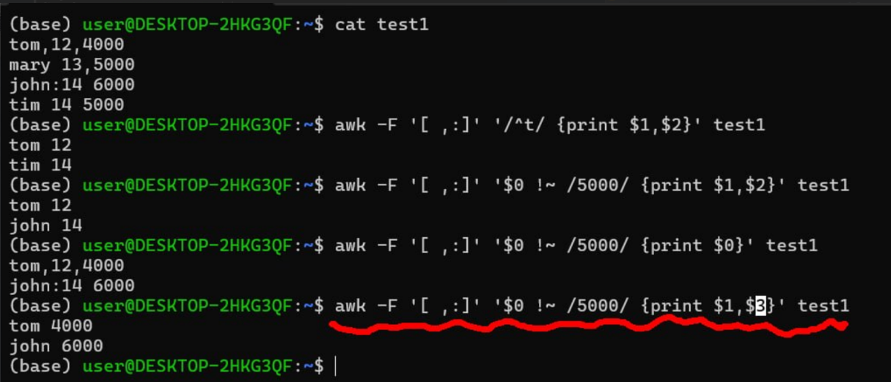

# 0519

## awk

### 切

  
預設是把「空格」當成切下去的地方
- `awk '{print $1,$4}' test`:
  - 功能：用預設的空格切開，然後給我第 1 塊 ($1) 和第 4 塊 ($4)
  - 結果：拿到了 10 和 orange,apple,mongo (因為逗號不會被切開)
- `awk -F, '{print $1,$4}' test`：
  - 功能：`-F`, 換一個能切逗號的分隔符
  - 結果：第一塊變成`10 There are orange，第 4 塊沒有東西 (因為整句只有兩個逗號，最多只能切成三塊)。
- `awk -F '[ ,]' '{print $1,$4}' test`：
  - 功能：`-F '[ ,]'`，只要看到空格或是逗號都切開
  - 結果：都被切開，第1塊是`10`，第4塊是`orange`

  
資料格式不固定情況下  
- `awk -F '[ ,:]' '{print $1,$2}' test1`
  - 功能：中括號 `[ ,:] `代表「空格、逗號、冒號」，只要看到這三個任何一個，就切！然後把切好的第 1 塊 ($1，名字) 和第 2 塊 ($2，年紀) 印出來。
  - 結果：拿到的所有人名和年紀
