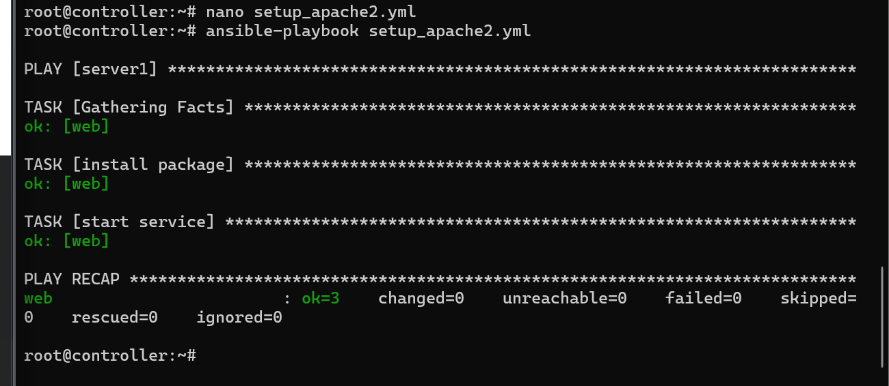

# ansible2

### 1. 測試階段(ping)

- 注意：如裝置重開，ip可能跑掉，建議給裝置建立固定ip
- 連線測試：
  1. 查看servers群組內的裝置連不連得上   
    ```ansible servers -m ping```
  2. 查看可以操作那些裝置  
   ```ansible servers --list-hosts```

### 2. 命令模組
- command(基本指令)  
  - ```ansible servers -m command -a "uptime"```
- shell(進階指令):支援`|`或`>`
  - ```ansible servers -m shell -a "echo hi > /tmp/a.txt"```

### 3. script模組
- 執行本地寫好的腳本
  - `ansible servers -m script -a "./a.sh"`

### 4. apt模組
- 安裝最新版的網頁伺服器 (apache2)：
  - ```ansible servers -m apt -a "name=apache2 state=latest"```
- 檢查有沒有安裝成功 (Ubuntu 檢查軟體是用 dpkg -l)：
  - ```ansible servers -m shell -a "dpkg -l | grep apache2"```
- 一次安裝兩個軟體(apache2和ftp)
  - ```ansible servers -m apt -a "name=apache2,vsftpd state=latest"```

### copy&fetch模組
- 複製檔案到裝置，把自己裝置的1.txt複製到裝置的hi.txt，`backup=yes`有同名的檔案，會先幫他備份才覆蓋
  - `ansible server1 -m copy -a "src=/root/1.txt dest=/tmp/hi.txt backup=yes"`
- 把檔案拿過來 (Fetch):把密碼檔複製一份回我的電腦
  - `ansible server1 -m fetch -a "src=/etc/passwd dest=/root"`

### file模組
新增修改檔案，或是管理檔案權限  
- 修改權限：把檔案設定成大家都能讀寫 (mode=666)。
  - `ansible server1 -m file -a "path=/tmp/test.txt mode=666"`
- 刪除檔案(state=absent 就是「讓它消失」的意思)：
  - `ansible server1 -m file -a "path=/tmp/test.txt state=absent"`

### service模組
啟動或重啟裝置模組指令  
- 啟動網頁伺服器
  - `ansible server1 -m service -a "name=apache2 state=started"`
- 修改網頁伺服器的 Port (把 80 改成 8080)：
  >要修改 /etc/apache2/ports.conf！
你要先把這個檔案用 fetch 拿回來，把裡面的 Listen 80 改成 Listen 8080，再用 copy 丟回去。
  - `ansible server1 -m service -a "name=http state=restarted"`


## playbook(劇本)
ansible的playbook格式使用YAML格式(許多伺服器使用的格式，禁止用tab縮排，只能用空白鍵縮排)

### 1.第一章簡單任務清單
寫一個`setup_apache2.yml`的清單，讓裝置去安裝apache2
```
---  # 三個橫槓代表清單開始
- hosts: server1           # 這張清單是給誰看的（給名叫 server1 的小弟）
  remote_user: root        # 用最高權限(老大)的身份去做
  
  tasks:                   # 任務開始啦！
    - name: install package      # 任務 1：裝軟體
      apt: name=apache2          # [Ubuntu 修改] 用 apt 裝 apache2
    
    - name: start service        # 任務 2：啟動軟體
      service: name=apache2 state=started
```

執行setup_apache2.yml：`ansible-playbook setup_apache2.yml

擔心寫錯可在後面加上`-C`(代表 Dry Run 預演)，先跑一次但不實際執行`ansible-playbook -C setup_apache2.yml`

### 強制忽略錯誤
可以在指令後面加上`|| /bin/true`
```YAML
- name: run a script
  shell: /usr/bin/somecommand || / bin/true
```

