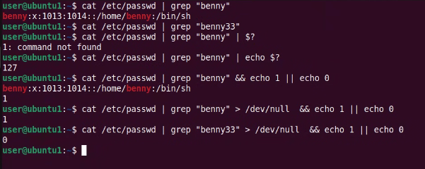

# 帳號管理

## 檔案屬性
lsattr file_name 查看檔案屬性  
|符號|attribute|
|:-|:-|
|+i|insert|
|+a|append|
### ACL
access control list  

linux分為 u、g、o
但現實中比較複雜
如果要 tom、mary可以讀但是peter不行    
myfile希望給user、mary讀取，但peter不行

```
xxx   xxx    xxx 
onwer groups other
r:讀
w:寫
x:執行
``` 

## 帳號安全
### AAA
Authentication Authorization Accounting/Audit  
認證授權紀錄

#### Authentication
輸入帳號密碼，確認身分
#### Authorization
檢查權限
#### Accounting
記錄登入後行為
#### Audit
包含Accounting並審查驗證行為是否符合規定


### MFA
Multi-Factor Authentication 多因素驗證  
除了輸入密碼外還要提供第二種證明

### Bastion Host/Jump Server/PAM
提供一個安全的專接點

## 建立帳號
### adduser
會自動跑完需要的所有流程

### useradd
不會主動建立房間、密碼，許手動設定資料  
```
sudo useradd -m -s /bin/bash user_name
sudo passwd user_name   改密碼
```
-m：建立家目錄  
-s：指定使用工具
### 新增sudo權限
```
# -a 代表 append (追加)，-G 代表 Group (群組)
sudo usermod -aG sudo 使用者名稱

sudo gpasswd -a 使用者名稱 sudo
```
加入sudo群組

## 加鹽 Salting
加密  
目的：
- 對抗彩虹表
- 防止批次破解：密碼即使相同，但鹽巴不同，雜湊值也不會一樣
- 增加攻擊成本  
加延後儲存在/etc/shadow:username:$6$vE9Q2z4N$....  
\$6\$：使用的加密演算法標記(\$6\$代表SHA-512)  
最後的長字串：加鹽後，雜湊運算的結果

## 補充
### alias

### file
```file file_name```
file test.txt ->可能顯示 ASCII text  
file hello ->可能顯示 ELF 64-bit LSB executable  
找出檔案真正的樣子


###　檢查

https://gemini.google.com/share/a08695b7e09e
