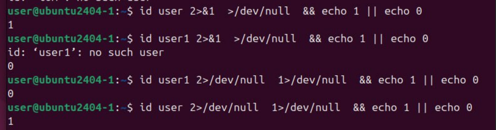
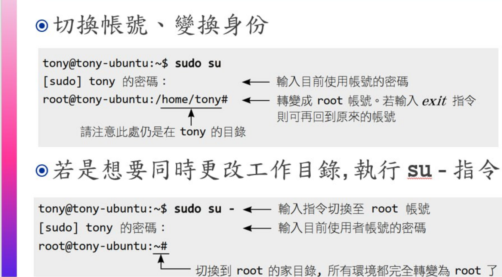
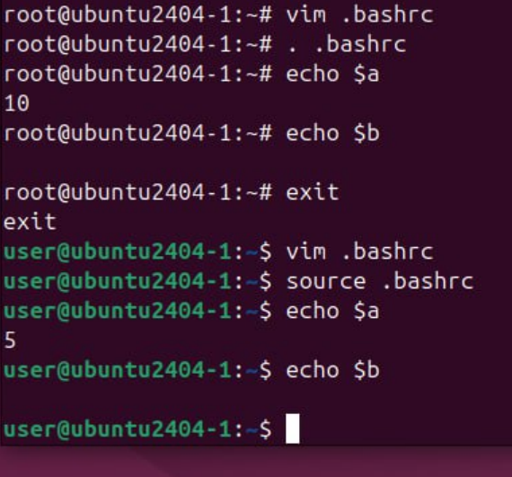
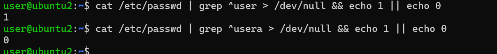

3
-

## Account
### etc
1. ```etc/passwd```  
   
2. ```etc/shadow```

## 檔案描述符(File Descriptors)
- 0：標準輸入Standard Input
- 1：標準輸出Standard Output
- 2：標準錯誤Standard Error  

```
/dev/null 2 >& 1
==
1 > /dev/null 2 > /dev/null
```


### 設定root
``` 
sudo usermod -aG sudo shawn
```
- usermod：修改使用者的指令。
- -aG：加入（Append）某個群組（Group）」。
- sudo：就是那個大官公會的名字。
- shawn：這就是你要封官的人。


1. ```sudo su```：一樣的身分，擁有root權限
2. ```sudo su-```：```-```代表登入，直接登入root身分，變成root本人身分


- ```.bashrc```：每個使用者的個人工作手冊  
- *每個帳號都是獨立的*： 就算變量名稱都叫 a，在 root 手裡是 10，在 user 手裡是 5

## 練習
1. 用一行命令，查詢帳號是否存在，存在顯示1，不存在顯示0
   
   


