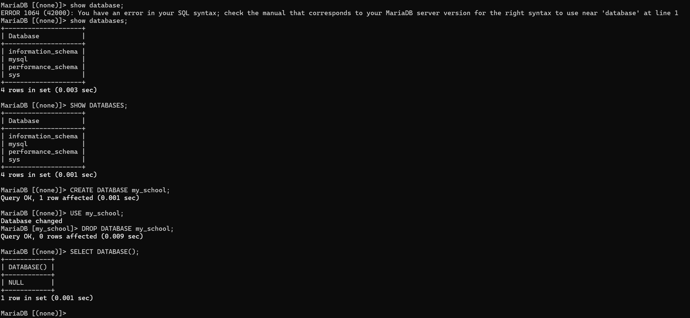
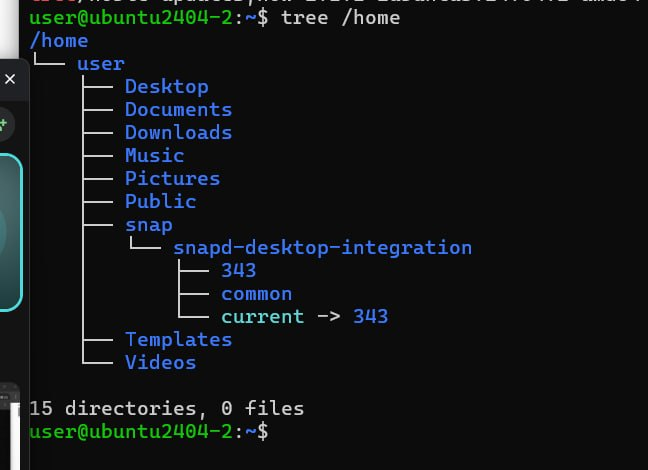
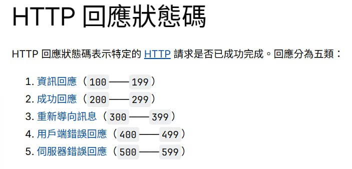

# 4Server

## mySQL
### 安裝
```
sudo apt install mysql-server #安裝
systemctl start mysql #啟動
systemctl status mysql #檢查狀態
sudo mysql -u root -p #登入
```
### 設定安全性
```sudo mysql_secure_installation```

### 開啟資料庫的遠端連線權限
讓資料庫接受來自外網的請求，而非僅限本機
```
sudo nano /etc/mysql/mysql.conf.d/mysqld.cnf    #MySQL
sudo nano /etc/mysql/mariadb.conf.d/50-server.cnf    #MariaDB
#找到　bind-address = 127.0.0.1
#改成　bind-address = 0.0.0.0

#重啟
sudo systemctl restart mysql 
sudo systemctl restart mariadb 

#進入資料庫
sudo mysql -u root -p 

#給權限
GRANT ALL PRIVILEGES ON *.* TO 'root'@'%' IDENTIFIED BY '你的密碼' WITH GRANT OPTION;
FLUSH PRIVILEGES;
EXIT;

#登入
mysql -u root -p 
mysql -h 192.168.206.135 -uroot -p
```

### 常用指令
1. 顯示所有資料庫  
`SHOW DATABASES;`  
列出目前所有的資料庫清單
2. 建立資料庫  
`CREATE DATABASE my_school;`  
3. 刪除資料庫  
`DROP DATABASE my_school;`  
4. 使用資料庫  
`USE my_school;`  
5. 確認我在哪個資料庫  
`SELECT DATABASE();`  


### 新增資料表
```
INSERT INTO addrbook (name, phone) VALUES ('王小明', '0911-111-111');
INSERT INTO addrbook (name, phone) VALUES ('李小華', '0922-222-222');
```  
看看資料進去沒  
```
SELECT * FROM addrbook;
``` 


### cluster集群
把「好幾台電腦」串在一起，讓它們看起來像「一台超級強大的電腦」在工作
- 高可用性：一台電腦壞了，另一台會自動接手
- 負載平衡：如果同時有一萬個人要查資料，一台電腦會跑不動。集群可以讓這三台電腦「分工合作」，每台處理一點點，速度就變快了
- 備援：資料會同時存在多台電腦裡，就算其中一台硬碟燒掉了，別台電腦裡還有備份

## 補充
### systemctl
- start
- stop
- restart
- enable：開機自動啟動
- disable：關閉開機自動啟動
- status：狀態

### 檢查軟體是否安裝
```
sudo apt list --installed | grep apache2 #檢查apache2是否安裝
```

### 安裝軟體之前
```
sudo apt update && sudo apt upgrade
# sudo apt update 檢查更新
# sudo apt upgrade 安裝更新
```

### 安裝軟體發生錯誤
```
user@ubuntu2404-2:~$ sudo apt install tree
Waiting for cache lock: Could not get lock /var/lib/dpkg/lock-frontend. It is held by process 3786 (unattended-upgr)... Waiting for cache lock: Could not get lock /var/lib/dpkg/lock-frontend. It is held by process 3786 (unattended-upgr)    
Waiting for cache lock: Could not get lock /var/lib/dpkg/lock-frontend. It is held by process 3786 (unattended-upgr)... Waiting for cache lock: Could not get lock /var/lib/dpkg/lock-frontend. It is held by process 3786 (unattended-upgr)
```
需要做軟體安裝工具資料更新
```
sudo apt update
#建議安裝軟體前,最好要先執行sudo apt update
```
### 刪除軟體指令
```
sudo apt remove [軟體名稱]
sudo apt remove tree
```

### 徹底刪除
```
sudo apt purge [軟體名稱]
sudo apt purge tree
```
將主程式及相關程式一併移除

### tree指令
用來顯示某個資料夾下的目錄與檔案,採用樹狀結構方式表現


### http狀態碼

- 2：成功
- 3：導向
- 4：錯誤
- 5：伺服器

### 檢查伺服器狀態
```
curl -o NUL -s -w "%{http_code}" http://192.168.164.139
```
- o NUL：我不進去坐，我不需要看你家長怎樣（不下載網頁內容）。
- s：安靜一點，不要跟我報告進度。
- w "%{http_code}"：最重要的部分。你只要鄰居大喊一個數字告訴我狀態就好。