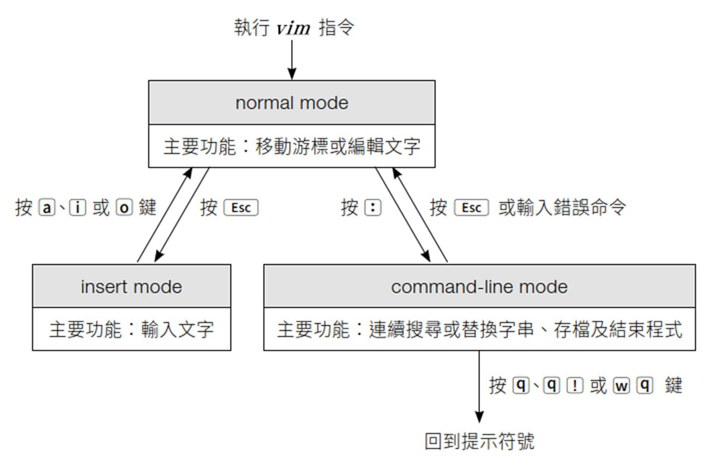

Class
-

## Vim


## 資料夾
### etc
系統資訊資料夾，存放電腦名稱、使用者帳號密碼、WIFI連接方法等等

## 指令

### ```$?```
使否執行成功  


### ```uneme```
Unix Name  
#### 參數
- ```-a```:a11
- ```-s```:System
- ```-r```:Release版本號
- ```-m```:硬體架構


## 補充

### MCP
Model Context Protocol  
AI 界的 「USB 全用插頭」  
將不同應用工具的接口通用化，讓AI方便在應用程式之間連動
