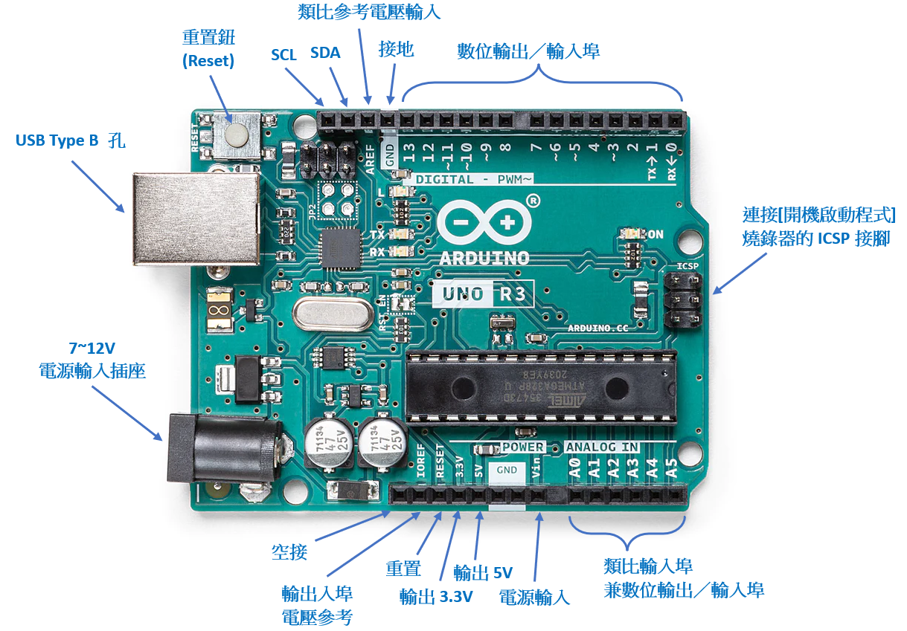
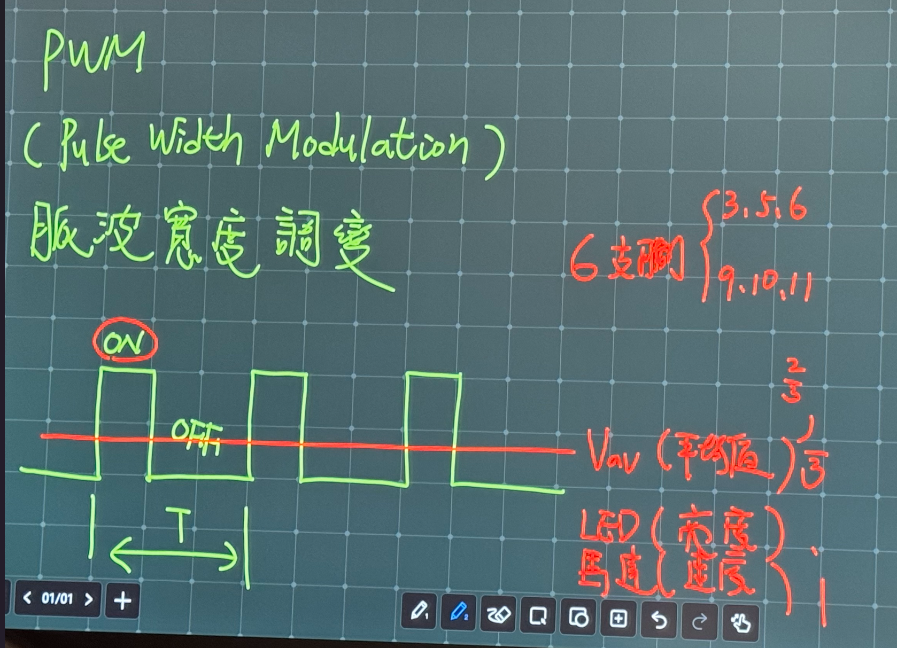
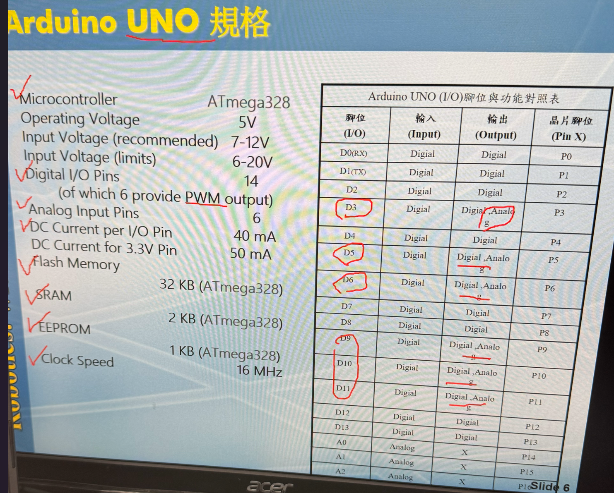

Single Chip 01
===
### 結構
##### 微電腦結構，至於同一個晶片的微電腦，
- 五大單元：微電腦輸入輸出、記憶、控制單元、算術邏輯單元，五個單元的集合  
- 系統單晶片SOC:把一台電腦濃縮成單一IC  
- 架構：CPU、記憶體、I/CPORT、計時器、計數器、串傳輸介面、A/D轉換器、D/A轉換器```A=Analog、D=digital```
- 優點：體積小、低成本、可靠度高
- 常見型號：
  - *8051*：intel的MCS-51，8Bit，**CISE**，40Pin
  - *PIC*：Microchip發展，低耗電防雜訊，**RISC**；防盜器、遙控器、倒車雷達
  - *AVR*：I/O腳位和8051通用，速度快；Xbox搖桿
```
CSIE：複雜指令集
EISC：精簡指令集  
```


| 規格 |  | 
|:-|-:| 
| Microcontroller | ATmega |
Operating Voltage|5V
Input Voltage(recommended)| 7-12V
input Voltage(limits)|6-20V
Digital I/O Pin(of which 6 provide PWM output)|6
DC Current per I/O Pin | 40mA
DC Current for 3.3V Pin | 50mA
Flash Memory |32KB
SRAM |2KB
EEPROM | 1KB
Clock Speed | 16MHz

```
PWM (Pulse Width Modulation)  
脈波寬度調變
```


