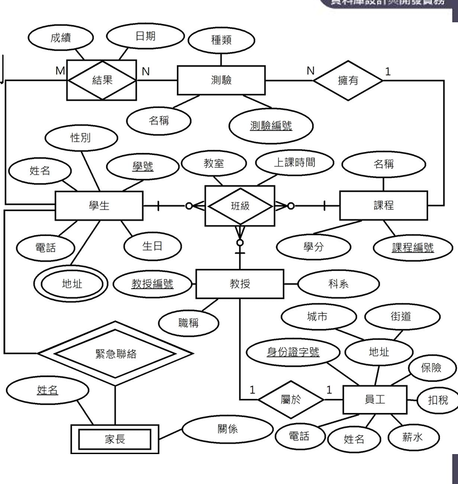

關聯模型正規畫
---
- [關聯模型正規畫](#關聯模型正規畫)
  - [實體關聯模型](#實體關聯模型)
  - [實體關聯圖](#實體關聯圖)
- [關聯表正規化](#關聯表正規化)
  - [正規化的基礎(前三階正規化)](#正規化的基礎前三階正規化)

### 實體關聯模型
- 圖形化模型
- 建立步驟
  - 從系統需求找出實體型態
  - 找出實體型態與其他型態的關聯
  - 定義實體型態的關聯性
    - 一對一
    - 一對多
    - 多對多
  - 定義實體型態的屬性型態與主鍵

### 實體關聯圖

- 實體型態
  - 實體型態，長方形節點
  - 實體集合，橢圓形節點
  - 關聯型態，菱形節點

## 關聯表正規化
### 正規化的基礎(前三階正規化)
- 第一階(1NF)，在關聯表刪除多重值和複合值屬性，讓關聯表只擁有單元值屬性
- 第二階(2NF)，滿足1NF，且關聯表沒有部份相依
- 第三階(3NF)，滿足2NF，且沒有遞移相依
- Boyce-Codd正規化，如關聯表有多個複合候選鍵，則需刪除候補鍵間的功能相依
- 